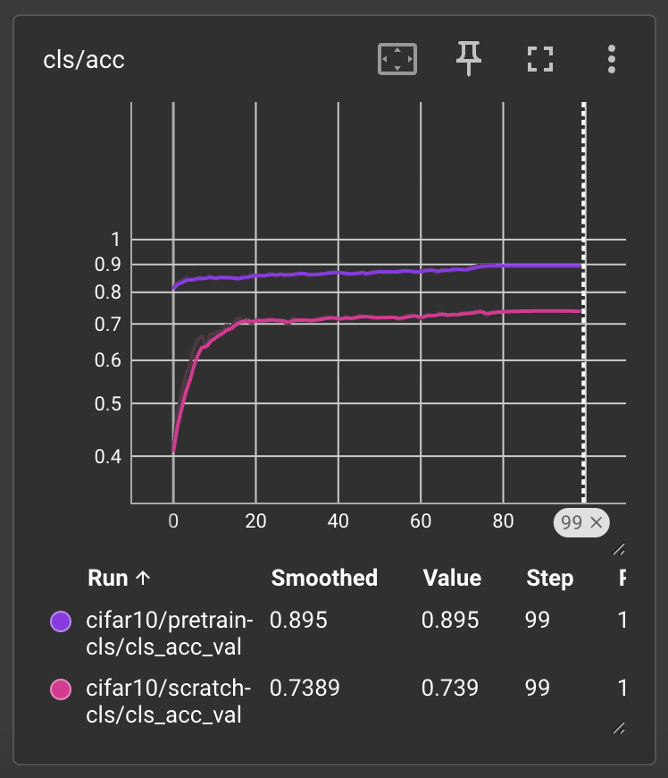
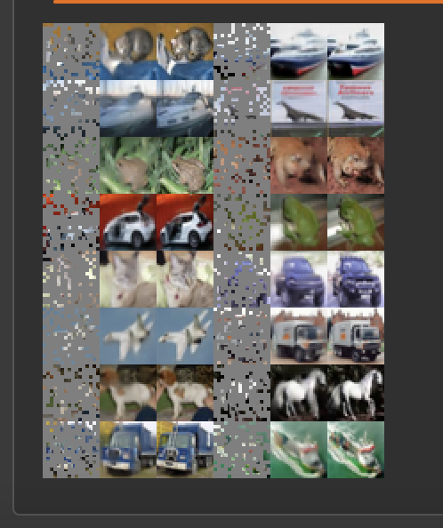

# Masked Autoencoder on CIFAR-10

A PyTorch implementation of Masked Autoencoder (MAE) pretraining with a ViT encoder, followed by downstream CIFAR-10 classification.

The project studies whether self-supervised MAE pretraining improves downstream classification compared with training the same classifier from scratch.

## Overview

The training pipeline consists of two stages:

1. MAE pretraining on the CIFAR-10 training set.
2. Transfer of the pretrained ViT encoder to a supervised CIFAR-10 classifier.

The downstream classifier is evaluated against an identically configured model initialized from scratch.

## Architecture

- Vision Transformer encoder
- 4 × 4 image patches
- 75% patch masking during MAE pretraining
- Transformer decoder for image reconstruction
- MSE reconstruction objective
- ViT encoder transferred to the downstream classifier

## Experimental Setup

| Setting | Value |
|---|---|
| Dataset | CIFAR-10 |
| Pretraining epochs | 1500 |
| Fine-tuning epochs | 100 |
| Mask ratio | 0.75 |
| Global batch size | 4096 |
| Per-GPU batch size | 2048 |
| Forward-pass batch size | 512 |
| GPUs | 2 × NVIDIA T4 |
| Optimizer | AdamW |
| Pretraining learning rate | 1.5e-4 × batch scaling |
| Weight decay | 0.05 |

## Training

The MAE pretraining pipeline uses:

- DistributedDataParallel (DDP)
- Automatic Mixed Precision (AMP)
- Gradient accumulation
- DistributedSampler
- Checkpointing and resume support
- TensorBoard logging

These were used to make long-running MAE pretraining practical on a multi-GPU Kaggle environment.

## Results

The downstream classifier was evaluated using the CIFAR-10 test set. Pretraining was performed for 1500 epochs using 2× NVIDIA T4 GPUs with distributed data parallelism, mixed precision, and gradient accumulation.

| Initialization | Test Accuracy |
|---|---:|
| ViT from scratch | 73.8% |
| MAE pretrained | 89.5% |

Best test accuracy obtained in the reported run: **89.5%** (MAE-pretrained) vs. **73.8%** (from scratch) — a difference of approximately 15.7 percentage points.



*Validation accuracy over 100 fine-tuning epochs. Pretrained initialization (purple) converges faster and to a higher accuracy than training from scratch (pink).*

## Reconstruction

The MAE was evaluated by reconstructing masked CIFAR-10 images during pretraining.



*Each triplet shows, left to right: masked input, MAE reconstruction, original image.*

## Interpretation

The pretrained encoder achieved substantially higher downstream classification accuracy than the same architecture trained from scratch.

This suggests that the representation learned through masked image reconstruction transferred effectively to supervised classification on CIFAR-10.

## Limitations

This study focuses on a single CIFAR-10 benchmark and a single primary training configuration due to computational constraints. The reported results therefore demonstrate the effectiveness of the implemented pipeline for this setting rather than providing a comprehensive ablation of MAE hyperparameters. Future work could evaluate different masking ratios, model sizes, pretraining durations, and additional datasets.

## Running

### MAE pretraining

```bash
torchrun --nproc_per_node=2 mae_pretrain.py --total_epoch 1500 --warmup_epoch 150
```

Resume pretraining:

```bash
torchrun --nproc_per_node=2 mae_pretrain.py --resume vit-t-mae.pt
```

Train classifier from scratch:

```bash
torchrun --nproc_per_node=2 train_classifier.py
```

Train classifier using the pretrained encoder:

```bash
torchrun --nproc_per_node=2 train_classifier.py --pretrained_model_path vit-t-mae.pt
```

## Project Structure

```
mae-cifar10/
├── mae_pretrain.py
├── train_classifier.py
├── model.py
├── utils.py
├── requirements.txt
└── README.md
```

## Reference

This implementation was adapted from [IcarusWizard/MAE](https://github.com/IcarusWizard/MAE), a PyTorch MAE implementation for CIFAR-10. The project extends that base training setup with DDP, AMP, gradient accumulation, checkpointing, and TensorBoard logging for efficient multi-GPU execution.

- He, K., Chen, X., Xie, S., Li, Y., Dollár, P., & Girshick, R. (2021). *Masked Autoencoders Are Scalable Vision Learners.* arXiv:2111.06377.

## Status

- [x] MAE implementation
- [x] CIFAR-10 pretraining
- [x] Multi-GPU DDP training
- [x] AMP
- [x] Gradient accumulation
- [x] Checkpoint/resume support
- [x] TensorBoard logging
- [x] Downstream classifier
- [x] Scratch vs MAE-pretrained comparison
- [x] Reconstruction visualization